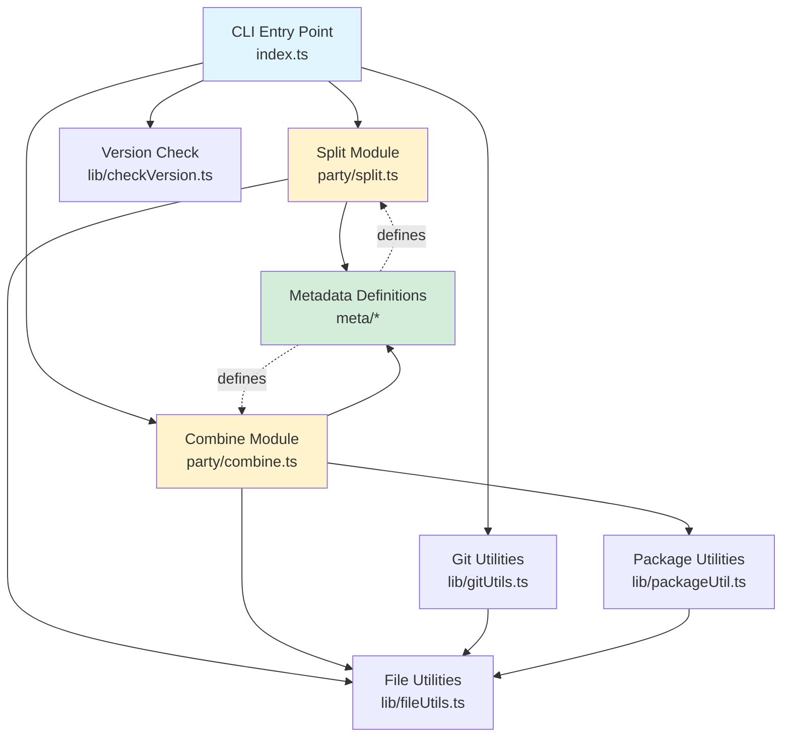
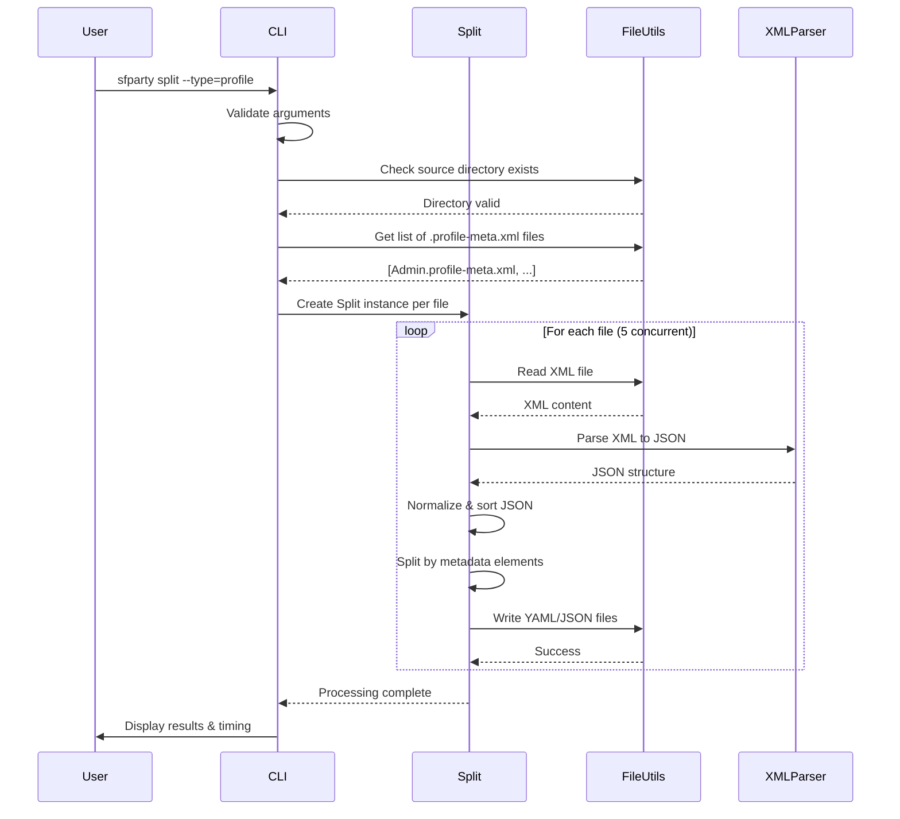
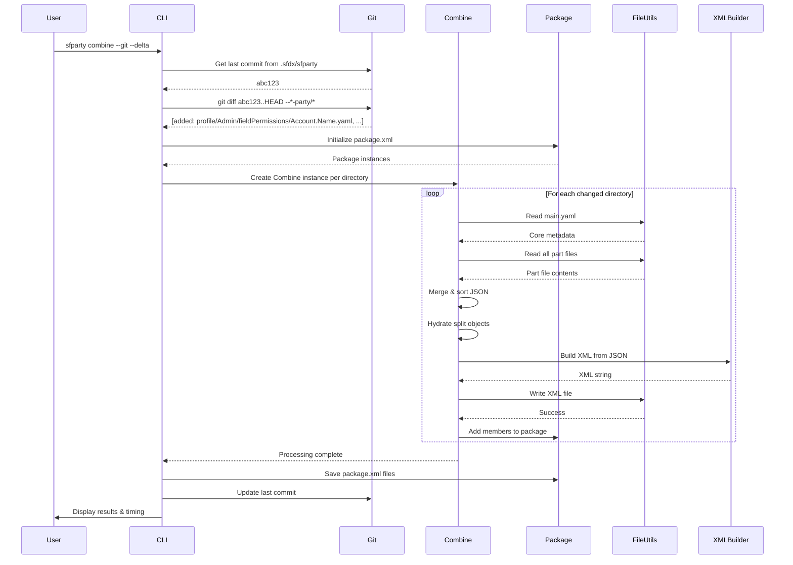
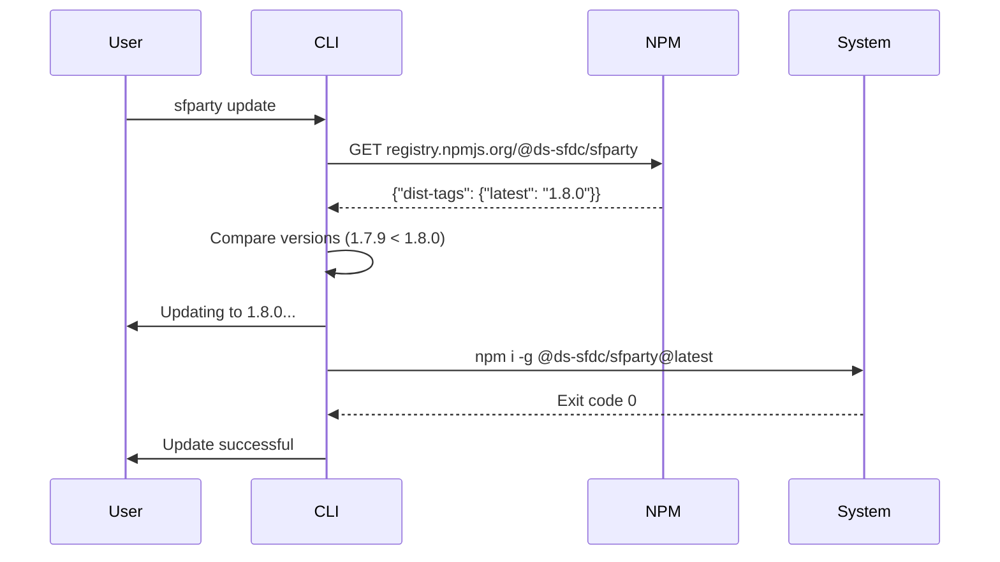

# Technical Deep-Dive: `sfparty`

## 1. Executive Summary

-   **Codebase Name:** @ds-sfdc/sfparty
-   **Type:** CLI Tool / Library
-   **Purpose & Domain:** sfparty is a Salesforce metadata management utility designed to improve developer and DevOps workflows by converting large Salesforce XML metadata files into smaller, more manageable YAML or JSON files. This transformation makes metadata easier to read, diff, version control, and merge, eliminating conflicts and corrupted XML issues. The tool is bidirectional, supporting both splitting (XML → YAML/JSON) and combining (YAML/JSON → XML), making it ideal for CI/CD pipelines and collaborative development on Salesforce projects.
-   **Key Technologies:** 
    - **Runtime:** Node.js (>=0.11) with TypeScript
    - **Package Manager:** Bun (used in CI/CD and development)
    - **Languages:** TypeScript 5.6
    - **Key Libraries:** 
        - `xml2js` - XML parsing and building
        - `js-yaml` - YAML processing
        - `yargs` - CLI argument parsing
        - `listr2` - Task list management and concurrent processing
        - `winston` - Logging
        - `cli-color` - Terminal styling
        - `semver` - Version comparison
    - **Testing:** Vitest with V8 coverage
    - **Linting/Formatting:** Biome (primary), ESLint (minimal)
    - **Git Hooks:** Husky with lint-staged

---

## 2. Architectural Overview

### Architectural Style

sfparty follows a **Layered Architecture** with a clear separation of concerns:

1. **CLI Layer** (`src/index.ts`) - Command-line interface and argument parsing
2. **Business Logic Layer** (`src/party/`) - Core split/combine operations
3. **Metadata Definition Layer** (`src/meta/`) - Salesforce metadata type configurations
4. **Utility Layer** (`src/lib/`) - File operations, Git integration, package management
5. **Type Definition Layer** (`src/types/`) - TypeScript type definitions

The architecture also incorporates **Event-Driven** patterns through Listr2 task management and **Plugin-Based** configuration through metadata definitions.

### Component Diagram



### Project Structure

```
sfparty/
├── src/                          # Source code
│   ├── index.ts                 # CLI entry point with yargs commands
│   ├── index.d.ts               # Type declarations
│   ├── party/                   # Core business logic
│   │   ├── split.ts            # XML → YAML/JSON conversion
│   │   └── combine.ts          # YAML/JSON → XML conversion
│   ├── meta/                    # Metadata type definitions
│   │   ├── CustomLabels.ts     # Custom labels configuration
│   │   ├── Profiles.ts         # Profile configuration
│   │   ├── PermissionSets.ts   # Permission set configuration
│   │   ├── Workflows.ts        # Workflow configuration
│   │   ├── Package.ts          # Package.xml configuration
│   │   └── yargs.ts            # CLI options configuration
│   ├── lib/                     # Utility modules
│   │   ├── fileUtils.ts        # File I/O operations
│   │   ├── gitUtils.ts         # Git integration
│   │   ├── packageUtil.ts      # Package.xml management
│   │   └── checkVersion.ts     # NPM version checking
│   └── types/                   # TypeScript type definitions
│       └── metadata.ts          # Core type interfaces
├── test/                        # Test suites (26 test files)
│   ├── party/                   # Split/combine tests
│   ├── lib/                     # Library tests
│   ├── meta/                    # Metadata definition tests
│   └── setup.ts                 # Test configuration
├── .github/                     # GitHub workflows & agents
│   ├── workflows/cicd.yaml     # CI/CD pipeline
│   └── agents/                  # AI agent configurations
├── examples/                    # Example metadata files
├── force-app/                   # Default Salesforce source
├── force-app-party/             # Default split output directory
└── dist/                        # Compiled JavaScript output
```

### Entry Points

-   **Primary CLI Entry:** `dist/index.js` (compiled from `src/index.ts`)
-   **Binary Command:** `sfparty` (globally installed via npm)
-   **Programmatic Entry:** `dist/index.js` (can be imported as module)

### Module/Component Analysis

#### CLI Module (`src/index.ts` - 1159 lines)
**Responsibilities:**
- Command-line argument parsing using yargs
- Command routing (split, combine, update, help)
- Global state initialization and management
- Git mode orchestration
- Process lifecycle management (timing, error handling, SIGINT)
- Version checking integration
- Package XML file management coordination

**Key Functions:**
- `splitHandler()` - Orchestrates split operations across multiple metadata types
- `combineHandler()` - Orchestrates combine operations with git integration
- `processSplit()` - Executes split operation for a single metadata type
- `processCombine()` - Executes combine operation for a single metadata type
- `gitMode()` - Manages git-based change tracking
- `gitFiles()` - Processes git diff results into metadata structures

#### Split Module (`src/party/split.ts` - 705 lines)
**Responsibilities:**
- Parse Salesforce XML metadata files
- Transform XML to normalized JSON structure
- Split monolithic files into discrete YAML/JSON files
- Maintain file organization by metadata type
- Handle special cases (sandbox login IP ranges, profile-specific logic)
- Progress reporting via Listr2 tasks

**Key Features:**
- Concurrent processing (5 files at a time)
- XML to JSON transformation with array normalization
- Sorting and key ordering based on metadata definitions
- Boolean value conversion
- File system operations with validation

#### Combine Module (`src/party/combine.ts` - 1062 lines)
**Responsibilities:**
- Read discrete YAML/JSON metadata files
- Merge into consolidated JSON structure
- Generate Salesforce-compliant XML
- Git delta support for CI/CD (only process changed files)
- Package.xml generation for deployments
- File timestamp preservation
- Handle special cases (IP range merging, split objects)

**Key Features:**
- Delta deployment mode (process only git changes)
- Package XML member tracking (add/remove)
- Object hydration for split metadata types
- File statistics tracking for timestamp preservation
- Destructive changes support

#### Metadata Definitions (`src/meta/`)
**Responsibilities:**
- Define structure and processing rules for each Salesforce metadata type
- Specify XML parsing/building configuration
- Define sort keys, key ordering, and XML element ordering
- Configure directory vs. single-file storage
- Enable/disable delta deployment support

**Metadata Types Supported:**
1. **CustomLabels** - Singular label collection
2. **Profiles** - Security profiles with field/object permissions
3. **PermissionSets** - Modular permission collections
4. **Workflows** - Workflow rules and actions

#### File Utilities (`src/lib/fileUtils.ts` - 411 lines)
**Responsibilities:**
- Safe file system operations with path validation
- YAML/JSON/XML file reading and writing
- Directory creation and deletion (recursive)
- Path traversal attack prevention
- Special character handling in filenames
- File metadata operations (timestamps, stats)

**Security Features:**
- Path validation against directory traversal
- Workspace root enforcement
- Error message sanitization
- Restricted file permissions (0o644)
- YAML parsing with JSON schema (prevents prototype pollution)

#### Git Utilities (`src/lib/gitUtils.ts` - 353 lines)
**Responsibilities:**
- Git repository detection and validation
- Git diff processing for change tracking
- Commit history management
- Branch-specific last commit tracking
- Git reference validation (command injection prevention)

**Key Functions:**
- `diff()` - Get changed files between git references
- `log()` - Retrieve commit history
- `lastCommit()` - Get last processed commit per branch
- `updateLastCommit()` - Store processed commit reference

#### Package Utilities (`src/lib/packageUtil.ts` - 348 lines)
**Responsibilities:**
- Package.xml file management
- Member addition/removal with duplicate detection
- XML generation from JSON structure
- Version number management from sfdx-project.json
- Package type sorting and organization

**Package Class:**
- `getPackageXML()` - Load or initialize package XML
- `addMember()` - Add metadata members to package
- `savePackage()` - Generate and write package XML

### API/Interface Analysis (CLI Tool)

#### Commands

**1. `sfparty split`**
- **Purpose:** Split Salesforce XML metadata into YAML/JSON files
- **Options:**
    - `-y, --type` - Metadata type(s): label, profile, permset, workflow
    - `-n, --name` - Specific metadata file name to process
    - `-f, --format` - Output format: yaml (default) or json
    - `-s, --source` - Source package directory
    - `-t, --target` - Target output directory
- **Examples:**
    - `sfparty split --type=profile`
    - `sfparty split --type=permset --name="Admin"`
    - `sfparty split --type="workflow,label"`

**2. `sfparty combine`**
- **Purpose:** Combine YAML/JSON files back into Salesforce XML
- **Options:**
    - `-y, --type` - Metadata type(s): label, profile, permset, workflow
    - `-n, --name` - Specific metadata file name to process
    - `-f, --format` - Input format: yaml (default) or json
    - `-s, --source` - Source part files directory
    - `-t, --target` - Target XML output directory
    - `-g, --git` - Git mode: process only changed files
    - `-a, --append` - Append to existing package XML (requires --git)
    - `-l, --delta` - Create delta metadata files (requires --git)
    - `-p, --package` - Path to package.xml
    - `-x, --destructive` - Path to destructiveChanges.xml
- **Examples:**
    - `sfparty combine --type=profile`
    - `sfparty combine --git --delta --append`
    - `sfparty combine --git=HEAD~1..HEAD --package=deploy/package.xml`

**3. `sfparty update`**
- **Purpose:** Update sfparty to latest version
- **No options required**

**4. `sfparty help`**
- **Purpose:** Display README.md in terminal
- **No options required**

---

## 3. Dependency Analysis

### Package Dependencies

#### Production Dependencies (`package.json`)

| Package | Version | Purpose |
|---------|---------|---------|
| `axios` | ^1.13.2 | HTTP client for NPM registry version checks |
| `ci-info` | ^4.1.0 | Detect CI environment to suppress verbose output |
| `cli-color` | ^2.0.4 | Terminal text coloring and styling |
| `cli-spinners` | ^2.9.2 | Animated spinner frames for progress indication |
| `convert-hrtime` | ^5.0.0 | Convert high-resolution time to human-readable format |
| `js-yaml` | ^4.1.1 | YAML parsing and stringification |
| `listr2` | ^8.1.3 | Task list management with concurrency support |
| `log-update` | ^6.1.0 | Update terminal output in-place for progress |
| `marked` | ^14.1.3 | Markdown to HTML converter |
| `marked-terminal` | ^7.2.1 | Markdown rendering for terminal |
| `pretty-quick` | ^4.0.0 | Run Prettier on changed files |
| `semver` | ^7.6.3 | Semantic version parsing and comparison |
| `util` | ^0.12.5 | Node.js utility functions |
| `winston` | ^3.17.0 | Logging framework |
| `xml2js` | ^0.6.2 | XML to JavaScript object conversion |
| `yargs` | ^17.7.2 | Command-line argument parsing |

#### Development Dependencies

| Package | Version | Purpose |
|---------|---------|---------|
| `typescript` | ^5.6.0 | TypeScript compiler |
| `vitest` | ^4.0.10 | Test framework |
| `@vitest/coverage-v8` | ^4.0.10 | Code coverage reporting |
| `@vitest/ui` | ^4.0.10 | Test UI interface |
| `husky` | ^9.1.7 | Git hooks management |
| `lint-staged` | ^15.2.10 | Run linters on staged files |
| `nodemon` | ^3.1.7 | Auto-restart during development |
| Various `@types/*` | - | TypeScript type definitions |

### External Dependencies

1. **NPM Registry** (`registry.npmjs.org`)
   - Purpose: Version checking and updates
   - Accessed via: HTTPS API calls
   - Timeout: 5 seconds

2. **Git** (system command)
   - Purpose: Change tracking, diff generation, commit management
   - Required for: Git mode operations (`--git` flag)
   - Commands used: `git diff`, `git log`, `git rev-parse`

3. **Salesforce Project Structure**
   - Required file: `sfdx-project.json` (must exist in workspace root)
   - Purpose: Determine package directories and API version

4. **Node.js File System**
   - All file operations (read, write, delete)
   - Directory operations
   - Path resolution

### Configuration

#### Configuration Sources

1. **`sfdx-project.json`** (Required in project root)
   ```json
   {
     "packageDirectories": [{"path": "force-app", "default": true}],
     "sourceApiVersion": "56.0"
   }
   ```
   - `packageDirectories[].path` - Source/target directory base
   - `packageDirectories[].default` - Default package selection
   - `sourceApiVersion` - Used in package.xml generation

2. **Environment Variables**
   - `INIT_CWD` - Detected for npx execution context
   - `HUSKY` - Set to 0 in CI/CD to disable git hooks

3. **Git Configuration** (`.sfdx/sfparty/index.yaml`)
   - Stores last processed commit per branch
   - Auto-created in project root
   - Format: YAML with git commit hashes

4. **Global State** (in-memory)
   - `global.format` - Output format (yaml/json)
   - `global.git` - Git mode configuration
   - `global.metaTypes` - Metadata type registry
   - `global.__basedir` - Workspace root path

#### Important Configuration Keys

- **Default Source Directory:** Determined from `sfdx-project.json` → `packageDirectories[0].path`
- **Default Target Directory:** `<sourceDir>-party` (e.g., `force-app-party`)
- **Concurrency:** 5 concurrent file operations (hardcoded)
- **Version Check Timeout:** 5000ms
- **Git Diff Pattern:** `*-party/*` (only tracks split files)

---

## 4. Core Functionality Analysis

### For CLI Tools: Commands and Workflows

#### Command: `split`

**Purpose:** Convert Salesforce XML metadata files into smaller YAML/JSON files for better version control and collaboration.

**Handler:** `splitHandler()` in `src/index.ts`

**Step-by-Step Flow:**

1. **Entry:** Command received via yargs CLI parser
2. **Validation:** 
   - Check metadata type is valid (label, profile, permset, workflow)
   - Validate name parameter compatibility
   - Ensure source directory exists
3. **Initialization:**
   - Load metadata definition for specified type(s)
   - Determine source directory (from sfdx-project.json or --source)
   - Determine target directory (source + "-party" or --target)
   - Scan for XML files matching metadata type
4. **Processing (per metadata type):**
   - Create Listr2 task list for all files
   - For each XML file (concurrent batch of 5):
     a. Parse XML to JSON using xml2js
     b. Normalize JSON structure (remove arrays, convert booleans)
     c. Sort and order keys according to metadata definition
     d. Split JSON into discrete files by metadata element
     e. Save files as YAML/JSON in target directory
5. **Special Handling:**
   - Profile sandbox IP ranges: Preserve existing sandbox-specific IPs
   - Main file: Create main.yaml/json with core metadata
   - Directory types: Create subdirectories for permission sets
6. **Completion:**
   - Display success/error count
   - Show execution time
   - Check for newer npm version

**Flow Diagram:**



#### Command: `combine`

**Purpose:** Merge YAML/JSON part files back into Salesforce XML metadata files for deployment.

**Handler:** `combineHandler()` in `src/index.ts`

**Authorization:** None (local file operations only)

**Step-by-Step Flow:**

1. **Entry:** Command received via yargs CLI parser
2. **Validation:**
   - Check metadata type is valid
   - Validate source directory exists
   - If --git mode: validate git repository
3. **Git Mode Initialization (if --git flag):**
   - Parse git reference (e.g., HEAD~1..HEAD)
   - Execute `git diff` to get changed files
   - Filter changes to *-party directories
   - Categorize as add/remove operations
   - Load/initialize package.xml files
4. **Processing (per metadata type):**
   - Determine directories to process:
     - Git mode: Only changed directories
     - Normal mode: All directories in source
   - Create Listr2 task list
   - For each metadata directory (concurrent batch of 5):
     a. Read main.yaml/json file
     b. Read all subdirectory part files
     c. Merge into single JSON structure
     d. Sort keys according to metadata definition
     e. Hydrate split objects (add object prefixes back)
     f. Generate XML using xml2js Builder
     g. Write XML to target directory
     h. Preserve file timestamps from part files
5. **Git Mode Package Management:**
   - Add new/modified items to package.xml
   - Add deleted items to destructiveChanges.xml
   - Save package XMLs
   - Update last commit reference
6. **Delta Mode (if --delta flag):**
   - Only process files present in git diff
   - Skip unchanged files even if they exist
7. **Completion:**
   - Display success/error count
   - Show execution time
   - Check for newer npm version

**Flow Diagram:**



#### Command: `update`

**Purpose:** Update sfparty to the latest npm version.

**Handler:** `checkVersion()` with `update: true`

**Step-by-Step Flow:**

1. **Entry:** Command received
2. **Version Check:**
   - Query NPM registry for latest version
   - Compare with current version using semver
3. **Update Decision:**
   - If newer version available:
     a. Display new version number
     b. Execute `npm i -g @ds-sfdc/sfparty@latest`
     c. Wait for completion
     d. Display success/error
   - If already latest: Display confirmation
4. **Error Handling:**
   - NPM not installed: Display helpful error
   - Update failed: Display error message

**Flow Diagram:**



---

## 5. Data Model & State Management

### Data Structures

#### Core Metadata Types

**`MetadataDefinition`** - Configuration for each Salesforce metadata type

```typescript
interface MetadataDefinition {
  metaUrl: string              // Salesforce documentation URL
  directory: string            // Directory name (e.g., 'profiles')
  filetype: string             // File extension (e.g., 'profile')
  root: string                 // XML root element (e.g., 'Profile')
  type: string                 // Package.xml type name
  alias: string                // CLI type alias
  main: string[]               // Main file elements
  singleFiles?: string[]       // Single-file elements
  directories?: string[]       // Multi-file elements
  splitObjects?: string[]      // Elements to split by object
  sortKeys: Record<string, string>      // Sort key per element
  keyOrder?: Record<string, string[]>   // Key ordering per element
  xmlOrder?: Record<string, string[]>   // XML ordering per element
  packageTypeIsDirectory?: boolean      // Package as directory
  delta?: boolean              // Supports delta deployment
  emptyPackage?: PackageStructure       // Package template
  emptyNode?: PackageNode      // Package node template
}
```

**Example: Profile Definition**
```typescript
{
  metaUrl: "https://developer.salesforce.com/.../meta_profile.htm",
  directory: "profiles",
  filetype: "profile",
  root: "Profile",
  type: "Profile",
  alias: "profile",
  main: ["fullName", "custom", "description", "userLicense", "$"],
  singleFiles: ["applicationVisibilities", "classAccesses", ...],
  directories: ["fieldPermissions", "objectPermissions", ...],
  splitObjects: ["fieldPermissions", "objectPermissions", ...],
  sortKeys: {
    fieldPermissions: "field",
    objectPermissions: "object",
    ...
  },
  keyOrder: {
    fieldPermissions: ["field", "editable", "readable"],
    ...
  },
  delta: true
}
```

#### Split File Structure

**Input:** `Admin.profile-meta.xml`
```xml
<?xml version="1.0" encoding="UTF-8"?>
<Profile xmlns="http://soap.sforce.com/2006/04/metadata">
    <fullName>Admin</fullName>
    <fieldPermissions>
        <field>Account.Name</field>
        <editable>true</editable>
        <readable>true</readable>
    </fieldPermissions>
    ...
</Profile>
```

**Output:** `force-app-party/main/default/profiles/Admin/`
```
main.yaml                              # Core metadata
fieldPermissions/
  Account.yaml                         # Field permissions by object
  Contact.yaml
objectPermissions/
  Account.yaml                         # Object permissions
  Contact.yaml
```

**main.yaml example:**
```yaml
main:
  name: Admin
  fullName: Admin
  custom: false
  userLicense: Salesforce
```

**fieldPermissions/Account.yaml example:**
```yaml
fieldPermissions:
  - field: Name
    editable: true
    readable: true
  - field: Phone
    editable: true
    readable: true
```

### Relationships

**Metadata Type → Definition:** 1:1
- Each supported metadata type has exactly one definition
- Definition controls all processing behavior

**XML File → Part Files:** 1:Many
- One XML file splits into multiple YAML/JSON files
- Relationship defined by metadata definition structure

**Git Commit → Changed Files:** 1:Many
- One commit range produces list of changed part files
- Used for delta deployments

**Package.xml → Metadata Members:** 1:Many
- One package contains multiple metadata type entries
- Each type contains multiple member names

### Data Persistence

#### File System Storage

**Split Mode (XML → YAML/JSON):**
- **Source:** `<packageDir>/main/default/<metadataDir>/*.xml`
- **Target:** `<packageDir>-party/main/default/<metadataDir>/<itemName>/*.yaml`
- **Pattern:** Hierarchical directory structure with discrete files

**Combine Mode (YAML/JSON → XML):**
- **Source:** `<packageDir>-party/main/default/<metadataDir>/<itemName>/*.yaml`
- **Target:** `<packageDir>/main/default/<metadataDir>/*.xml`
- **Pattern:** Consolidated XML files

**Git State:**
- **File:** `.sfdx/sfparty/index.yaml`
- **Content:** Last processed commit per branch
- **Format:**
  ```yaml
  git:
    lastCommit: abc123def456
    branches:
      main: abc123def456
      feature-branch: def456abc123
  local:
    lastDate: null
  ```

**Package XML:**
- **Files:** `manifest/package-party.xml`, `manifest/destructiveChanges-party.xml`
- **Content:** Salesforce deployment manifests
- **Generated:** In git mode with --append flag

### State Management

#### Global State Object

sfparty uses a global state object augmented onto Node.js `global` object:

```typescript
interface GlobalContext {
  __basedir?: string           // Workspace root path
  logger?: Logger              // Winston logger instance
  icons?: Icons                // Terminal icons/emoji
  displayError?: Function      // Error display helper
  git?: GitConfig             // Git mode configuration
  metaTypes?: Record<string, MetaTypeEntry>  // Metadata registry
  runType?: string            // Execution context (global/npx/node)
  format?: string             // Output format (yaml/json)
  process?: ProcessedStats    // Processing statistics
}
```

**Initialization:** Set in `src/index.ts` on module load

**Scope:** Global across all modules via `declare const global`

**Lifecycle:** Exists for duration of command execution

#### Session State

**Per-Command State:**
- Command arguments (preserved in handler closures)
- Listr2 task contexts (isolated per task)
- File processing statistics (success/error counts)
- Timer values (process start time)

**Immutable After Init:**
- Metadata definitions
- CLI configuration
- Workspace paths

**Mutable During Execution:**
- Package.xml contents
- Git changed file lists
- Processing error messages
- File statistics (timestamps)

---

## 6. Cross-Cutting Concerns

### Logging & Monitoring

**Framework:** Winston logger with console transport

**Configuration:**
```typescript
winston.createLogger({
  levels: { error: 0, warn: 1, info: 2, http: 3, verbose: 4, debug: 5, silly: 6 },
  format: winston.format.cli(),
  transports: [new winston.transports.Console()]
})
```

**Log Levels Used:**
- `error` - Fatal errors, file not found, parsing errors
- `warn` - Unexpected metadata types, validation warnings
- `info` - Command completion, version check results

**Progress Indication:**
- **Listr2:** Task list UI with concurrent execution visualization
- **log-update:** In-place terminal updates for single-file progress
- **cli-spinners:** Animated spinner for processing indication
- **Suppressed in CI:** Progress output disabled when `ci-info.isCI === true`

**Observability:**
- Execution timing (high-resolution timers via `process.hrtime.bigint()`)
- File processing counts (total, errors, current)
- Git diff statistics (added/removed files)
- No external monitoring/tracing integration

### Error Handling

**Strategy:** Defensive programming with graceful degradation

**Patterns:**

1. **Command-Level:**
   - Promise-based with rejection handling
   - Errors propagated to CLI handler
   - Exit with code 1 on fatal errors

2. **File-Level:**
   - Try-catch around individual file operations
   - Continue processing remaining files on error
   - Accumulate error count for final report

3. **Validation:**
   - Early validation of arguments (yargs check)
   - Path traversal prevention
   - Git reference sanitization

4. **Special Cases:**
   - Version check failures: Silent (don't block operations)
   - Missing part files in combine: Create empty or skip based on context
   - YAML parsing errors: Throw with descriptive message

**Error Types:**

```typescript
// Custom errors
class NpmNotInstalledError extends Error
class PackageNotFoundError extends Error  
class UpdateError extends Error

// Native errors caught
- SyntaxError: YAML/JSON parsing
- Error: File not found, permission denied
- YAMLException: Invalid YAML format
```

**Recovery Mechanisms:**
- Deleted files in combine: Remove XML and add to destructiveChanges
- Missing main file: Delete entire metadata item
- Corrupt XML: Log error, skip file, continue processing

### Authentication & Authorization

**None required** - sfparty operates entirely on local file system

**Security Considerations:**
1. No network authentication
2. No Salesforce org connection
3. No credential storage
4. Only local file system access within workspace

**Git Integration:**
- Uses system git command
- Inherits user's git configuration
- No separate authentication needed

### Testing

**Framework:** Vitest 4.0.10 with V8 coverage

**Test Organization:**
```
test/
├── party/           # Split/combine integration tests
├── lib/            # Unit tests for utilities
│   ├── file/       # File operations tests
│   ├── git/        # Git integration tests
│   ├── package/    # Package management tests
│   └── party/      # Party helper function tests
├── meta/           # Metadata definition tests
└── src/            # CLI tests
```

**Test Configuration:**
```javascript
{
  globals: true,
  environment: 'node',
  maxWorkers: 1,          // Sequential execution
  setupFiles: ['./test/setup.ts'],
  coverage: {
    provider: 'v8',
    reporter: ['text', 'html', 'clover', 'json'],
    include: ['src/**/*.ts'],
    exclude: ['src/lib/pkgObj.cjs', 'src/index.ts']
  }
}
```

**Test Types:**

1. **Unit Tests (26 test files):**
   - File operations (read, write, delete, validate paths)
   - Git utilities (diff, log, commit tracking)
   - Package utilities (add member, save package)
   - Helper functions (sort, convert, update stats)

2. **Integration Tests:**
   - Split module end-to-end
   - Combine module end-to-end
   - Git workflow integration

3. **Coverage Exclusions:**
   - `src/index.ts` - CLI entry point (requires integration testing)
   - `src/lib/pkgObj.cjs` - External CommonJS module

**Test Execution:**
- `bun test` - Run all tests once
- `bun run test:watch` - Watch mode
- `bun run test:ui` - Vitest UI
- `bun run test:coverage` - Generate coverage report

**Mocking Strategy:**
- File system operations: Stubbed fs module
- Git commands: Stubbed execFileSync/spawn
- HTTP requests: Stubbed axios
- Time operations: Controlled time values

### Build & Deployment

#### Build Process

**Compiler:** TypeScript 5.6

**Configuration (`tsconfig.json`):**
```json
{
  "target": "ES2022",
  "module": "ES2022",
  "outDir": "./dist",
  "declaration": true,
  "sourceMap": true,
  "strict": true
}
```

**Build Commands:**
- `bun run build` - Compile TypeScript to dist/
- `bun run build:watch` - Watch mode compilation
- `bun run typecheck` - Type check without emit

**Build Output:**
```
dist/
├── index.js        # CLI entry point
├── index.d.ts      # Type declarations
├── index.js.map    # Source map
├── party/
├── lib/
├── meta/
└── types/
```

#### CI/CD Pipeline

**Platform:** GitHub Actions

**Workflow (`.github/workflows/cicd.yaml`):**

```yaml
name: CI/CD
on:
  push:
    branches: [ main ]
  pull_request:
    branches: [ main ]

jobs:
  build:
    runs-on: ubuntu-latest
    steps:
      - Checkout code
      - Setup bun (latest)
      - Cache bun dependencies
      - Install dependencies (frozen lockfile)
      - Build project
      - Run tests
```

**Environment:**
- **OS:** Ubuntu Latest
- **Runtime:** Bun (latest)
- **Caching:** Bun install cache
- **Husky:** Disabled (HUSKY=0)

**Stages:**
1. Dependency installation
2. TypeScript compilation
3. Test execution (sequential, maxWorkers=1)

**No deployment stage** - NPM publishing is manual

#### Git Hooks

**Framework:** Husky 9.1.7

**Pre-commit Hook:**
```bash
#!/usr/bin/env sh
. "$(dirname -- "$0")/_/husky.sh"

npx lint-staged
```

**Lint-Staged Configuration:**
```json
{
  "lint-staged": {
    "*.{js,ts}": ["biome check --write"]
  }
}
```

**Actions:**
- Run Biome linter on staged JS/TS files
- Auto-fix issues where possible
- Abort commit if linting fails

#### NPM Package

**Package Name:** `@ds-sfdc/sfparty`

**Entry Points:**
- `bin`: `dist/index.js`
- `main`: `dist/index.js`
- `types`: `dist/index.d.ts`

**Files Included:**
- `dist/` - Compiled JavaScript
- `README.md` - Documentation
- `LICENSE.md` - BSD-3-Clause

**Publishing:**
- Command: `npm publish`
- Pre-publish: Automatic `bun run build`
- Registry: npmjs.org

### Performance Considerations

**Concurrency:**
- **Split:** 5 concurrent file operations via Listr2
- **Combine:** 5 concurrent file operations via Listr2
- **Rationale:** Balance between speed and system resource usage

**Memory Management:**
- Streaming not used (files loaded entirely into memory)
- Suitable for typical Salesforce metadata sizes (< 10MB per file)
- No memory pooling or explicit GC tuning

**Caching:**
- No persistent caching between runs
- Metadata definitions loaded once at startup
- Git commit tracking prevents redundant work

**Optimizations:**

1. **Delta Mode:**
   - Process only changed files in git mode
   - Significant time savings in CI/CD
   - Reduces deployment package size

2. **Sequential Type Processing:**
   - Types processed one at a time
   - Concurrent files within each type
   - Prevents resource contention

3. **Early Termination:**
   - Skip processing if no files found
   - Exit immediately on fatal validation errors

**Performance Characteristics:**
- Small projects (< 10 files): < 1 second
- Medium projects (10-100 files): 1-5 seconds  
- Large projects (100+ files): 5-30 seconds
- Git delta mode: 50-90% faster than full processing

**Scalability Concerns:**
- Very large XML files (>50MB): May cause memory pressure
- Hundreds of concurrent files: Limited to batch size of 5
- No distributed processing support

---

## 7. Development & Contribution Guide

### Getting Started

#### Prerequisites

1. **Node.js:** Version >= 0.11 (recommended: LTS 18.x or 20.x)
2. **Bun:** Latest version (used for development and testing)
3. **Git:** Required for git mode features
4. **Salesforce Project:** Valid `sfdx-project.json` in workspace root

#### Installation

**As Global CLI Tool:**
```bash
npm install -g @ds-sfdc/sfparty
```

**As Project Dependency:**
```bash
npm install --save-dev @ds-sfdc/sfparty
```

**From Source (Development):**
```bash
git clone https://github.com/TimPaulaskasDS/sfparty.git
cd sfparty
bun install
bun run build
```

#### Environment Setup

1. **Configure sfdx-project.json:**
   ```json
   {
     "packageDirectories": [
       {"path": "force-app", "default": true}
     ],
     "sourceApiVersion": "56.0"
   }
   ```

2. **Initialize Git (for git mode features):**
   ```bash
   git init
   ```

3. **Prepare Metadata:**
   - Ensure Salesforce metadata exists in package directory
   - Supported types: Profiles, Permission Sets, Workflows, Custom Labels

### Development Workflow

#### Running Locally

**Development Mode:**
```bash
bun run dev                    # Compile and run
bun run build:watch            # Auto-recompile on changes
```

**Execute Commands:**
```bash
node dist/index.js split --type=profile
node dist/index.js combine --type=permset
```

**Watch Tests:**
```bash
bun run test:watch            # Auto-run tests on changes
bun run test:ui               # Visual test interface
```

#### Hot Reload

**Using Nodemon:**
```bash
bun run dev                    # Configured with nodemon.json
```

**Nodemon Configuration:**
```json
{
  "watch": ["src"],
  "ext": "ts",
  "exec": "bun run build && node dist/index.js"
}
```

#### Debugging

**VS Code Launch Configuration:**
```json
{
  "type": "node",
  "request": "launch",
  "name": "Debug sfparty",
  "program": "${workspaceFolder}/dist/index.js",
  "args": ["split", "--type=profile"],
  "preLaunchTask": "bun: build",
  "sourceMaps": true,
  "outFiles": ["${workspaceFolder}/dist/**/*.js"]
}
```

**Console Logging:**
```typescript
global.logger?.info('Debug message')     // Standard logging
console.log(clc.magentaBright('Debug'))  // Colored output
```

### Testing

#### Running Tests

**All Tests:**
```bash
bun run test                   # Single run
bun run test:watch            # Watch mode
bun run test:ui               # UI interface
bun run test:coverage         # With coverage report
```

**Specific Test Files:**
```bash
bun test test/party/split.test.ts
bun test test/lib/git/diff.test.ts
```

**Test Naming Convention:**
- File: `<module>.test.ts`
- Describe blocks: Feature or function name
- Test cases: "should <expected behavior>"

#### Adding New Tests

**Unit Test Example:**
```typescript
// test/lib/myFunction.test.ts
import { describe, it, expect, vi } from 'vitest'
import { myFunction } from '../../src/lib/myModule'

describe('myFunction', () => {
  it('should process input correctly', () => {
    const result = myFunction('input')
    expect(result).toBe('expected')
  })
  
  it('should handle errors gracefully', () => {
    expect(() => myFunction(null)).toThrow('Invalid input')
  })
})
```

**Integration Test Example:**
```typescript
// test/party/integration.test.ts
import { describe, it, expect, beforeEach, afterEach } from 'vitest'
import { Split } from '../../src/party/split'
import * as fileUtils from '../../src/lib/fileUtils'

describe('Split Integration', () => {
  beforeEach(() => {
    // Setup test fixtures
  })
  
  afterEach(() => {
    // Cleanup
  })
  
  it('should split profile XML into YAML files', async () => {
    // Test implementation
  })
})
```

### Code Style & Standards

#### Linting

**Primary Linter:** Biome (configured in `biome.json`)

**Rules:**
- `useConst`: error - Prefer const over let
- `noExplicitAny`: warn - Avoid explicit any types
- Tab indentation (width: 4)
- Line width: 80 characters
- Single quotes for strings
- Trailing commas
- Semicolons as needed (ASI)

**Running Linter:**
```bash
bun run lint                   # Check for issues
bun run lint:fix              # Auto-fix issues
```

#### Formatting

**Primary Formatter:** Biome

**Configuration:**
- Indent: Tabs (4 spaces)
- Line ending: LF
- Quote style: Single
- Trailing commas: All
- Semicolons: As needed

**Running Formatter:**
```bash
bun run format                 # Format all files
```

#### TypeScript Standards

**Strict Mode:** Enabled
- No implicit any
- Strict null checks
- No unused locals
- No unused parameters
- No implicit returns
- No fallthrough cases

**Type Definitions:**
- All public APIs must have explicit types
- Prefer interfaces over types for objects
- Use type guards for runtime checks
- Export types from `src/types/metadata.ts`

**Example:**
```typescript
// Good
export interface MyConfig {
  name: string
  enabled: boolean
}

export function processConfig(config: MyConfig): Result {
  // Implementation
}

// Avoid
function process(config: any): any {
  // Implementation
}
```

### Suggested Extension Points

#### 1. Adding a New Metadata Type

**Location:** `src/meta/`

**Steps:**
1. Create metadata definition file (e.g., `ApexClasses.ts`)
2. Define `MetadataDefinition` object
3. Export as `metadataDefinition`
4. Register in `src/index.ts` `global.metaTypes`
5. Add to `typeArray` constant
6. Add tests in `test/meta/`

**Template:**
```typescript
// src/meta/ApexClasses.ts
import type { MetadataDefinition } from '../types/metadata.js'

export const metadataDefinition: MetadataDefinition = {
  metaUrl: 'https://developer.salesforce.com/...',
  directory: 'classes',
  filetype: 'cls',
  root: 'ApexClass',
  type: 'ApexClass',
  alias: 'apexclass',
  main: ['apiVersion', 'status'],
  singleFiles: [],
  directories: [],
  sortKeys: {},
  delta: false
}
```

#### 2. Adding New CLI Options

**Location:** `src/meta/yargs.ts`

**Steps:**
1. Add option definition to `options` object or `getOptions()` function
2. Update option processing in `src/index.ts`
3. Add validation in `yargCheck()` function
4. Update `combineOptions` or `splitOptions` arrays
5. Update README.md documentation

**Example:**
```typescript
// src/meta/yargs.ts
optionObj.verbose = {
  alias: 'v',
  demand: false,
  description: 'verbose output',
  type: 'boolean'
}
```

#### 3. Extending File Utilities

**Location:** `src/lib/fileUtils.ts`

**Steps:**
1. Add new utility function
2. Export function
3. Add TypeScript types
4. Include security validation
5. Add unit tests in `test/lib/file/`

**Guidelines:**
- Always validate paths using `validatePath()`
- Use `replaceSpecialChars()` for file names
- Return descriptive errors
- Handle both sync and async cases

#### 4. Custom Metadata Transformations

**Location:** `src/party/split.ts` or `src/party/combine.ts`

**Use Cases:**
- Custom key ordering logic
- Special element handling
- Format-specific processing

**Extension Point:**
```typescript
// In split.ts processFile()
if (that.metadataDefinition.alias === 'custom-type') {
  // Custom transformation logic
  json = customTransform(json)
}
```

### Identified Risks & Technical Debt

#### Security Risks

1. **Path Traversal (MITIGATED):**
   - Risk: User-provided paths could access files outside workspace
   - Mitigation: `validatePath()` function prevents traversal
   - Remaining: None - validation enforced consistently

2. **Command Injection (MITIGATED):**
   - Risk: Git references could inject shell commands
   - Mitigation: `validateGitRef()` sanitizes git references
   - Remaining: None - uses execFileSync with array args

3. **Prototype Pollution (MITIGATED):**
   - Risk: YAML parsing could pollute Object.prototype
   - Mitigation: Uses `yaml.JSON_SCHEMA` for safe parsing
   - Remaining: None - consistent safe parsing

#### Technical Debt

1. **Global State Usage:**
   - Issue: Extensive use of global object for state
   - Impact: Testing complexity, potential race conditions
   - Recommendation: Refactor to dependency injection pattern
   - Priority: Medium

2. **Limited Concurrency Control:**
   - Issue: Hardcoded batch size of 5 files
   - Impact: May not be optimal for all environments
   - Recommendation: Make configurable via CLI option
   - Priority: Low

3. **Memory Usage for Large Files:**
   - Issue: Entire files loaded into memory
   - Impact: Cannot handle extremely large metadata files (>100MB)
   - Recommendation: Implement streaming for large files
   - Priority: Low (rare in Salesforce context)

4. **Error Messages Could Be More Specific:**
   - Issue: Some errors lack context (file name, line number)
   - Impact: Harder to debug YAML syntax errors
   - Recommendation: Enhanced error reporting with context
   - Priority: Medium

5. **Test Coverage Gaps:**
   - Issue: CLI entry point (`src/index.ts`) excluded from coverage
   - Impact: Integration-level bugs may not be caught
   - Recommendation: Add integration tests for CLI workflows
   - Priority: Medium

6. **Type Safety in XML Transformations:**
   - Issue: Heavy use of `unknown` and type assertions in combine/split
   - Impact: Runtime errors possible with malformed data
   - Recommendation: Stronger type guards and validation
   - Priority: Medium

#### Anti-Patterns Identified

1. **Nested Promises in index.ts:**
   - Pattern: Promise-in-Promise without proper chaining
   - Location: `combineHandler()` startProm handling
   - Recommendation: Refactor to async/await
   - Priority: Low

2. **Side Effects in Constructors:**
   - Pattern: File path manipulation in Split/Combine setters
   - Impact: Harder to test, unexpected mutations
   - Recommendation: Move to initialization methods
   - Priority: Low

3. **Mixed Error Handling:**
   - Pattern: Some functions throw, others return boolean/string
   - Impact: Inconsistent error handling patterns
   - Recommendation: Standardize on exceptions or result types
   - Priority: Medium

### Common Development Tasks

#### Adding a New CLI Command

1. Add command definition in `src/index.ts`:
   ```typescript
   .command({
     command: '[my-command]',
     aliases: ['mycommand'],
     describe: 'Description of command',
     builder: (yargs) => {
       yargs.options(myOptions)
       return yargs
     },
     handler: (argv) => {
       myCommandHandler(argv)
     }
   })
   ```

2. Implement handler function
3. Add tests in `test/src/`
4. Update README.md with examples

#### Updating Dependencies

```bash
# Check for outdated packages
bun outdated

# Update all to latest
bun update

# Update specific package
bun update typescript

# Run tests after update
bun test
```

**Important:** Always test thoroughly after dependency updates, especially:
- `xml2js` - Core XML processing
- `js-yaml` - YAML parsing
- `listr2` - Task management
- `yargs` - CLI parsing

#### Creating a Release

1. Update version in `package.json`
2. Update CHANGELOG (if exists)
3. Run full test suite: `bun test`
4. Build: `bun run build`
5. Commit: `git commit -am "chore: bump version to x.x.x"`
6. Tag: `git tag vx.x.x`
7. Push: `git push && git push --tags`
8. Publish: `npm publish`

#### Debugging Git Mode Issues

```bash
# Test git diff processing
git diff HEAD~1..HEAD --name-status --relative -- *-party/*

# Check last commit tracking
cat .sfdx/sfparty/index.yaml

# Verify package XML generation
cat manifest/package-party.xml
cat manifest/destructiveChanges-party.xml

# Run in git mode with debug output
DEBUG=* sfparty combine --git --delta
```

#### Troubleshooting Build Issues

**TypeScript Errors:**
```bash
bun run typecheck              # Check types without building
bun run build                  # Full build with errors
```

**Missing Types:**
- Ensure `@types/*` packages installed
- Check `tsconfig.json` includes paths

**Import Resolution:**
- All imports must use `.js` extension
- Relative imports: `'./module.js'`
- Types: `import type { Type } from './types'`

---

## Appendix A: Key Algorithms

### XML to JSON Transformation

**Location:** `src/party/split.ts` - `transformJSON()`

**Purpose:** Convert xml2js output to normalized JSON structure

**Algorithm:**
1. Stringify JSON with custom replacer
2. For each key in sortKeys, preserve as-is
3. For other values, apply `xml2json()`:
   - Single-element arrays → scalar values
   - "true"/"false" strings → booleans
4. Parse stringified result
5. For each root element:
   - Apply `keySort()` recursively
   - Sort arrays by sortKey
   - Order object keys by keyOrder
6. Return transformed structure

### Git Delta File Filtering

**Location:** `src/party/combine.ts` - `processStart()`

**Purpose:** Process only changed files in git mode

**Algorithm:**
1. Build path match pattern: `/<metadataDir>/<itemName>/`
2. Filter added files:
   - Include if path contains pattern (case-insensitive)
3. Filter deleted files:
   - Include if path contains pattern (case-insensitive)
4. Check for main file deletion:
   - Check if any deleted file ends with `/main.{format}`
5. For each part file:
   - Skip if not in added/deleted lists
   - Skip if not main file
   - Process only matching files

### Object Hydration (Combine)

**Location:** `src/party/combine.ts` - `hydrateObject()`

**Purpose:** Restore object prefixes removed during split

**Algorithm:**
1. Get sortKey for metadata element
2. Extract object name from JSON
3. For each array item:
   - Prepend object name to sortKey value
   - Example: `Name` → `Account.Name`
   - Remove `.undefined` if present
4. Add object key back if in keyOrder
5. Delete temporary object property
6. Return hydrated structure

---

## Appendix B: Metadata Type Details

### Supported Metadata Types

#### 1. CustomLabels

**XML Structure:** Single file containing all labels
**Split Structure:** One file per label
**Package Type:** Directory-based
**Delta Support:** Yes
**Special Handling:** None - straightforward splitting

**Key Elements:**
- `labels[]` - Array of label definitions

**Example:**
```yaml
# labels/MyLabel.yaml
labels:
  fullName: MyLabel
  shortDescription: Description
  protected: false
  language: en_US
  value: Label Text
```

#### 2. Profile

**XML Structure:** Large monolithic file with permissions
**Split Structure:** Main file + directories for permissions
**Package Type:** File-based
**Delta Support:** Yes
**Special Handling:** 
- Split field/object permissions by object
- Sandbox IP ranges preserved separately
- Main file contains core metadata

**Key Elements:**
- Main: `fullName`, `custom`, `description`, `userLicense`
- Single Files: `applicationVisibilities`, `classAccesses`, `pageAccesses`, etc.
- Directories: `fieldPermissions`, `objectPermissions`, `recordTypeVisibilities`

**Example Structure:**
```
Admin/
  main.yaml
  fieldPermissions/
    Account.yaml
    Contact.yaml
  objectPermissions/
    Account.yaml
  loginIpRanges.yaml
  loginIpRanges-sandbox.yaml
```

#### 3. PermissionSet

**XML Structure:** Similar to Profile but modular
**Split Structure:** Main file + permission directories
**Package Type:** File-based
**Delta Support:** Yes
**Special Handling:** Similar to Profile

**Key Elements:**
- Main: `fullName`, `label`, `description`
- Single Files: `applicationVisibilities`, `classAccesses`, etc.
- Directories: `fieldPermissions`, `objectPermissions`

#### 4. Workflow

**XML Structure:** Workflow rules and actions
**Split Structure:** Rule files + alert/task directories
**Package Type:** File-based
**Delta Support:** Yes
**Special Handling:** Split by workflow rule/action type

**Key Elements:**
- Main: `fullName`
- Directories: `alerts`, `fieldUpdates`, `rules`, `tasks`

---

## Appendix C: Error Codes & Messages

### Common Error Messages

| Error Message | Cause | Resolution |
|--------------|-------|------------|
| `sfdx-project.json has invalid JSON` | Malformed JSON in project file | Fix JSON syntax |
| `Could not determine base path...` | No sfdx-project.json found | Run from Salesforce project root |
| `File not found: <path>` | Metadata file doesn't exist | Check file path and name |
| `Invalid type: <type>` | Unsupported metadata type | Use: label, profile, permset, workflow |
| `You cannot specify --name when using multiple types` | Conflicting arguments | Remove --name or use single type |
| `Path traversal detected` | Invalid path in argument | Use relative paths within workspace |
| `Git reference contains invalid characters` | Malformed git ref | Use valid commit hash or branch name |
| `npm is not installed` | NPM not in PATH | Install npm or add to PATH |

### Exit Codes

- `0` - Success
- `1` - General error (validation, file not found, etc.)

---

## Appendix D: Environment Variables

| Variable | Purpose | Values | Used By |
|----------|---------|--------|---------|
| `INIT_CWD` | Detect npx execution | Directory path | CLI context detection |
| `HUSKY` | Disable git hooks in CI | 0 or 1 | CI/CD pipeline |
| `NODE_ENV` | Node environment | development, production | Not explicitly used |
| `DEBUG` | Debug logging | * or module names | Not implemented |

---

## Appendix E: File Format Examples

### YAML Output (Default)

```yaml
fieldPermissions:
  - field: Name
    editable: true
    readable: true
  - field: Phone
    editable: false
    readable: true
```

### JSON Output (--format=json)

```json
{
  "fieldPermissions": [
    {
      "field": "Name",
      "editable": true,
      "readable": true
    },
    {
      "field": "Phone",
      "editable": false,
      "readable": true
    }
  ]
}
```

### Package XML Output

```xml
<?xml version="1.0" encoding="UTF-8"?>
<Package xmlns="https://soap.sforce.com/2006/04/metadata">
  <types>
    <members>Admin</members>
    <members>Standard</members>
    <name>Profile</name>
  </types>
  <version>56.0</version>
</Package>
```

---

**Document Version:** 1.0  
**Last Updated:** December 2024  
**Codebase Version:** 1.7.9  
**Maintainer:** Tim Paulaskas


