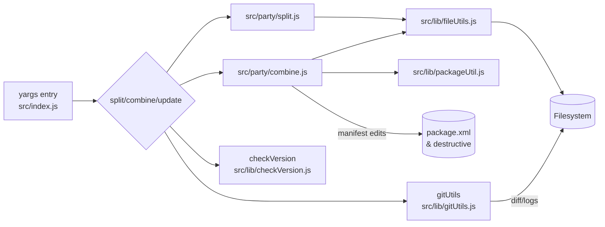

# Technical Deep-Dive: sfparty

## 1. Executive Summary
- **Codebase Name:** @ds-sfdc/sfparty (npm CLI)
- **Type:** CLI Tool targeting Salesforce DX metadata repos
- **Purpose & Domain:** Splits large Salesforce metadata XML files into YAML/JSON “part files” to improve readability, diffs, and merge safety; recombines parts back to deployable XML and can generate delta manifests for CI/CD.
- **Key Technologies:** Node.js (ESM), yargs CLI, xml2js, js-yaml, winston, cli-color/log-update, axios (version checks), git integration, Jest.

## 2. Architectural Overview
- **Architectural Style:** Single-process CLI with modular helpers; command routing via yargs; filesystem-centric processing.
- **Component Diagram:**

- **Project Structure:** Single package; `src/index.js` (CLI orchestration); `src/party` (split/combine engines); `src/meta` (metadata definitions, yargs options); `src/lib` (file, git, version, package utilities); examples and manifest templates; Jest tests in `test/`.
- **Entry Points:** `src/index.js` is the bin target (`sfparty`). Commands: `split`, `combine`, `update`, `help`, `test` registered via yargs (`src/index.js:155-208`).
- **Module/Component Analysis:**
  - CLI bootstrap sets globals (logger, icons, git/meta type registries) and resolves SFDX package root (`src/index.js:41-124`, `src/index.js:322-372`).
  - Split engine parses XML -> JSON, normalizes ordering, and writes part files with progress UI (`src/party/split.js:20-207`).
  - Combine engine reads part files -> JSON -> XML, supports git-based delta packaging and manifest updates (`src/party/combine.js:19-200`, `src/party/combine.js:360-560`).
  - Metadata definitions describe per-type directories, sort orders, and packaging rules (`src/meta/*.js`).
  - Git utilities detect changes for delta mode and persist last processed commit (`src/lib/gitUtils.js`).
  - Package utility edits package.xml/destructiveChanges manifests when delta mode is on (`src/lib/packageUtil.js`).
- **API/Interface Analysis (CLI):**
  - `sfparty split [--type label|profile|permset|workflow] [--name <metadata>] [--source <pkgDir>] [--target <dir>] [--format yaml|json]`
  - `sfparty combine` with same selectors plus `--git [<ref>] --append --delta --package <file> --destructive <file>`
  - `sfparty update` (self-update check), `sfparty help`, `sfparty test` stub.

## 3. Dependency Analysis
- **Package Dependencies:** yargs CLI parsing; xml2js for XML<->JS; js-yaml for YAML; winston/cli-color/log-update/cli-spinners for UX; axios+semver for update checks; marked/marked-terminal for help rendering; ci-info for CI-aware logging; xml diff packaging via custom code.
- **External Dependencies:** Git CLI required for delta mode; reads SFDX project metadata (`sfdx-project.json`) and writes package/destructive manifests; optionally hits npm registry for version checks.
- **Configuration:** CLI flags (above); SFDX root from nearest `sfdx-project.json` (`src/index.js:322-372`); git diff range from `--git` or stored `.sfdx/sfparty/index.yaml`; manifests default to `manifest/package-party.xml` and `manifest/destructiveChanges-party.xml`.

## 4. Core Functionality Analysis (CLI Workflows)
- **Split:**
  - Locates source metadata under `<packageDir>/main/default/<typeDir>` via SFDX default package.
  - For each metadata XML (`*.{type}-meta.xml`), parse to JSON, normalize namespaces, sort keys, and emit part files: `main.{format}`, per-section YAML/JSON, and subdirectories for complex sets (`src/party/split.js:76-207`).
  - Progress spinner shows per-file status; preserves sandbox login IP ranges if present.
- **Combine:**
  - Reads part files from `<packageDir>-party/main/default/<typeDir>/<item>/`; reconstructs JSON per metadata definition (ordering, object hydration), then builds XML with xml2js builder (`src/party/combine.js:88-200`, `src/party/combine.js:360-720`).
  - Git/delta mode: filters to changed files, updates package/destructive manifests via Package util; handles deletions by removing XML and adding destructive members.
  - Supports `--append` to reuse existing manifests; `--delta` to only include changed members; `--package`/`--destructive` override paths.
- **Update:** Fetches npm dist-tag and suggests/executes upgrade depending on install context (`src/lib/checkVersion.js`).

## 5. Data Model & State Management
- **Metadata Definitions:** Objects per type define directory names, root XML tags, sort keys, key ordering, package mapping, and delta eligibility (`src/meta/*.js`). These drive both split and combine behavior.
- **Global State:** CLI populates `global.metaTypes` for type lookup and `global.git` for diff context (`src/index.js:73-109`). Progress counters in split/combine modules are module-level singletons.
- **Persistence:** Reads/Writes metadata XML/YAML/JSON on disk; stores last processed git commit in `.sfdx/sfparty/index.yaml` (`src/lib/gitUtils.js:61-147`); generates/updates `manifest/package-party.xml` and `manifest/destructiveChanges-party.xml`.

## 6. Cross-Cutting Concerns
- **Logging & Monitoring:** Winston console logger with CLI levels (`src/index.js:43-56`); progress with log-update/spinners; errors surfaced via `global.displayError`.
- **Error Handling:** Mixed promise chains and try/catch; many paths log and continue, some `process.exit(1)` for fatal setup issues (e.g., missing sfdx-project.json).
- **Authentication & Authorization:** None; relies on local filesystem and git.
- **Testing:** Jest; unit coverage for version checker; minimal sample test (`test/lib/checkVersion.spec.js`, `test/src/root.spec.js`). No integration tests for split/combine paths.
- **Build & Deployment:** Published npm package; binary entry defined in `package.json`; husky/lint-staged/ESLint/Prettier configured; CI badge references GitHub Actions.
- **Performance Considerations:** In-memory parse/build of entire metadata files; sorting in JS; delta mode can avoid processing unchanged items; potential memory cost for very large profiles/workflows.

## 7. Development & Contribution Guide
- **Getting Started:** Requires Node >=14 (practically) and git; run `npm install`; ensure `sfdx-project.json` exists in working dir.
- **Development Workflow:** Use `npm test` for Jest suite; run CLI locally via `node src/index.js split ...` or `npm link`/`npx .` for bin; nodemon config present for live reload during local trials.
- **Testing:** Add Jest tests under `test/`; mock filesystem/git for split/combine to keep deterministic; consider fixture-based XML/YAML roundtrips.
- **Code Style & Standards:** ESLint + Prettier; lint-staged hooks for staged JS; ES modules with some CJS compat (`pkgObj.cjs`).
- **Suggested Extension Points:** Add metadata types by defining new `metadataDefinition` module and registering in `global.metaTypes`; enhance git delta filters; add more CI-safe logging or dry-run mode.
- **Identified Risks & Technical Debt:** Heavy reliance on globals complicates composability and testing; limited error propagation in async flows; duplicate utility code in split/combine (sorting, timing); minimal test coverage for core logic; Node engine spec (`>=0.11`) out of date vs actual dependency requirements.
- **Common Tasks:** Add new option—extend `src/meta/yargs.js`; add metadata type—create `src/meta/<Type>.js` and register in `src/index.js`; adjust manifest behavior—edit `src/lib/packageUtil.js`; tweak git delta—update `src/lib/gitUtils.js` and combine filtering logic.
- **Remotes & Push Workflow:** Primary remote `company` (`git@github.com:DTS-Productivity-Engineering/sfparty.git`) is tracked by `main`; public mirror remains `origin` (`git@github.com-personal:TimPaulaskasDS/sfparty.git`). Run `git push` (or `git push company main`) to publish internally; mirror with `git push origin main`. Optional: `git config alias.pushall '!git push company main && git push origin main'` or set `git config remote.pushDefault company` to make `git push` always target the company remote.

## 8. Companion Tool: VS Code Extension (sfparty-vscode)
- **Repository:** Located at `~/Code/sfpartyVsCodeExtension` (separate from CLI package)
- **Purpose:** Provides IDE integration for managing Salesforce metadata references within the part files created by the sfparty CLI. Automates the tedious task of manually editing YAML files to add/remove metadata references across profiles and permission sets.
- **Publisher:** sfpartyTeam
- **Activation:** Extension activates on startup and registers commands available via context menu and command palette.

### 8.1. Core Functionality
The extension operates on the `-party` directories created by `sfparty split`, specifically targeting Profile and Permission Set YAML files:

#### Commands & Context Menus
1. **Remove Reference** (`sfparty.removeReference`)
   - **Trigger:** Right-click on selected text in YAML files within `profiles/` or `permissionsets/` directories
   - **Requirements:** File must be saved (not dirty), YAML format, not `main.yaml`, single selection only
   - **Action:** Removes the selected YAML node and its parent structure from all profile/permission set files in the workspace

2. **Modify Reference** (`sfparty.modifyReference`)
   - **Trigger:** Same context as Remove Reference
   - **Action:** Opens webview panel to modify existing reference values across multiple files; allows bulk updates of metadata references

3. **Remove File and References** (`sfparty.removeFileAndReferences`)
   - **Trigger:** Right-click on Salesforce metadata files in Explorer (files under `main/default/` but NOT in `-party` directories)
   - **Action:** Deletes the file and automatically removes all references to it from profile/permission set YAML files
   - **Scope:** Works for classes, applications, flows, pages, tabs, layouts, custom metadata, external data sources, and more

#### File Deletion Listener
- **Configuration:** `sfparty.enableFileDeletionListener` (default: `true`)
- **Behavior:** Monitors `onDidDeleteFiles` events; when files under `main/default/` are deleted, automatically cleans up references from part files
- **Supported Metadata Types:** Classes (with associated XML), objects (fields/custom objects), applications, credentials, custom metadata, custom permissions, custom settings, data category groups, emails, flows, layouts, pages, tabs, and external data sources
- **Special Handling:** 
  - Classes: Deletes both `.cls` and `.cls-meta.xml` files
  - Objects: Handles field and object deletions differently based on file vs. directory type

### 8.2. Architecture & Integration
- **Dependencies:** `fast-glob` for file pattern matching; `js-yaml` for YAML parsing/writing; uses VS Code API for UI and file operations
- **Module Structure:**
  - `src/index.js`: Entry point with dependency injection pattern
  - `src/services/extension.js`: Main `SfPartyExtension` class; command registration, file path validation, file deletion listener
  - `src/lib/fileHandlers.js`: `FileHandlers` class; YAML node removal, reference cleanup, file deletion orchestration
  - `src/lib/util.js`: `Util` class; YAML operations, webview communication, file system utilities
  - `src/lib/salesforceMetadata.js`: `SalesforceMetadata` class; metadata type definitions (mapping Salesforce metadata to YAML node names and key structures)
  - `src/lib/logger.js`: `Logger` class; VS Code output channel integration

- **Data Flow:**
  1. User triggers command via context menu
  2. Extension validates file path (must match `main/default/` structure, not in `-party` directory)
  3. For text selection: Extracts YAML structure with parent context using `findParentNodes`
  4. Searches all profile/permission set YAML files using `fast-glob` patterns
  5. Removes matching nodes from each file using `js-yaml` parse/stringify
  6. Writes updated YAML back to disk

- **Webview Integration:** Uses VS Code webview panels for modify operations; communicates via message passing for multi-file batch updates

### 8.3. Metadata Type Mappings
The extension maintains a comprehensive mapping (`salesforceMetadata.js`) between Salesforce metadata folders and their corresponding YAML node structures in split files:
- **Classes** → `classAccesses` (key: `apexClass`)
- **Applications** → `applicationVisibilities` (key: `application`)
- **Flows** → `flowAccesses` (key: `flow`)
- **Pages** → `pageAccesses` (key: `apexPage`)
- **Layouts** → `layoutAssignments` (key: `layout`)
- **Custom Metadata** → `customMetadataTypeAccesses` (key: `name`)
- **Objects** → `objectPermissions`, `fieldPermissions`, `recordTypeVisibilities`
- And 15+ more metadata types...

### 8.4. Key Design Patterns
- **Dependency Injection:** All classes receive dependencies via constructor for testability (vscode, fs, path, logger, etc.)
- **Class-Based Architecture:** Follows OOP principles with clear separation of concerns
- **Deferred Execution:** Uses `setImmediate` for non-blocking file operations
- **Context-Aware Commands:** Extensive `when` clauses ensure commands only appear in valid contexts
- **Safety Checks:** Validates file paths, checks for unsaved changes, prevents execution on `main.yaml` files

### 8.5. Integration with CLI Workflow
The extension assumes the following workflow:
1. Developer runs `sfparty split` to create `-party` directory structure with YAML part files
2. Developer uses VS Code extension to manage references (add/remove metadata permissions)
3. Developer runs `sfparty combine` to reconstruct XML files from modified YAML parts
4. Standard Salesforce deployment occurs with combined XML

**Critical Path:** The extension operates exclusively on the YAML part files in the `-party` directory structure, never directly modifying the source XML files in `main/default/`. This ensures the CLI remains the source of truth for XML↔YAML transformations.

### 8.6. Development & Testing
- **Test Framework:** Mocha with Sinon for mocking
- **Test Location:** `test/suite/` mirrors `src/` structure
- **VSCode Test Integration:** Uses `@vscode/test-electron` for extension testing
- **Code Style:** ESLint + Prettier; husky hooks for pre-commit validation
- **Build:** CommonJS modules; no compilation step required

### 8.7. Identified Risks & Limitations
- **No Undo Support:** File operations are immediate; relies on git for rollback
- **Race Conditions:** Multiple simultaneous deletions could conflict; no locking mechanism
- **Limited Error Recovery:** Partial failures in batch operations may leave inconsistent state
- **YAML Structure Assumptions:** Tightly coupled to CLI's YAML output format; breaking changes in CLI would require extension updates
- **No Validation:** Doesn't verify YAML syntax or Salesforce metadata validity after modifications
- **Memory Overhead:** Loads entire YAML files into memory; could be problematic for very large profiles
