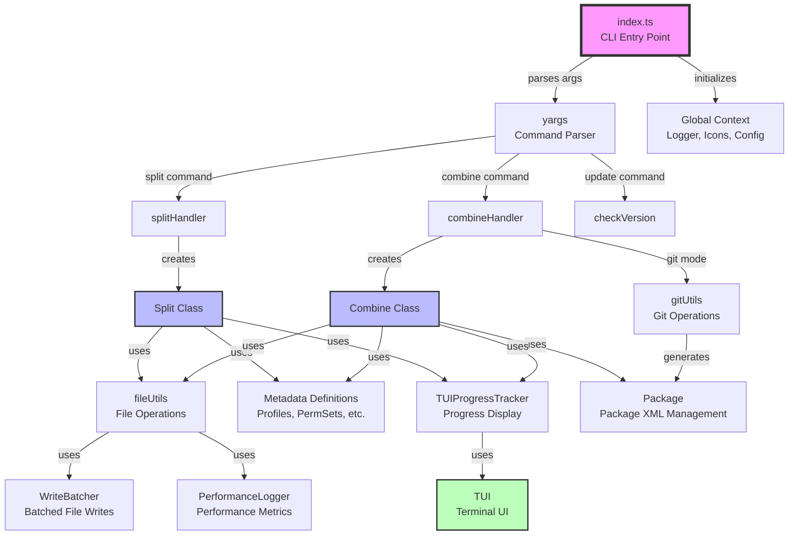
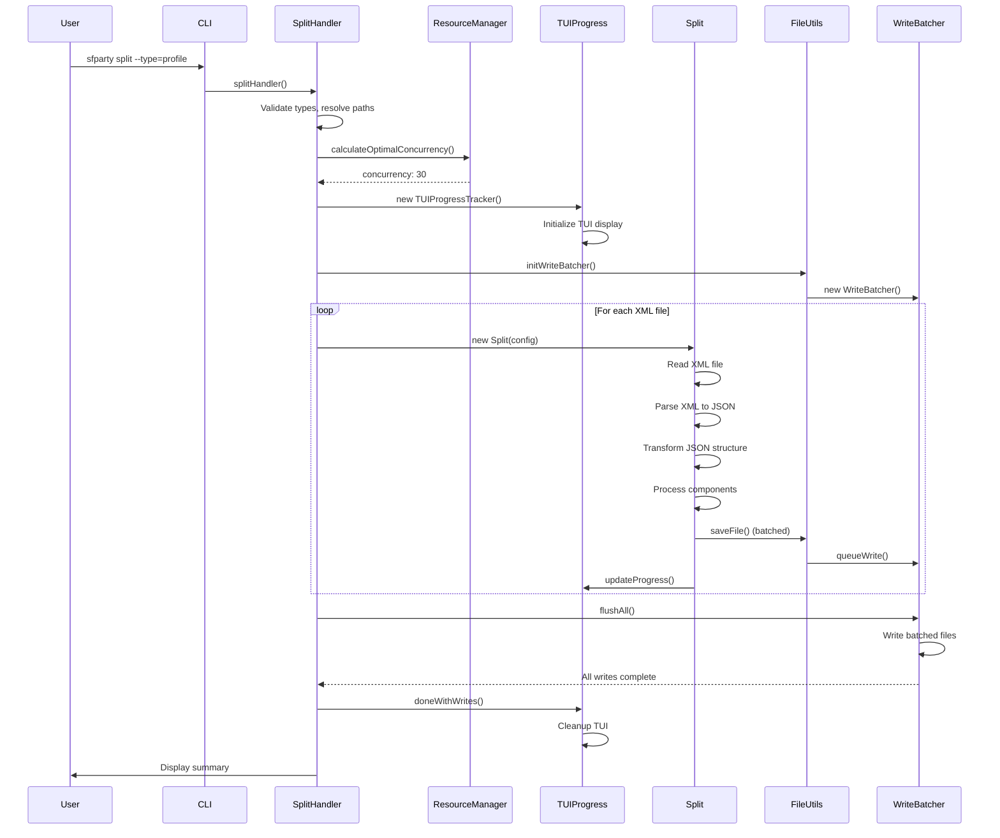
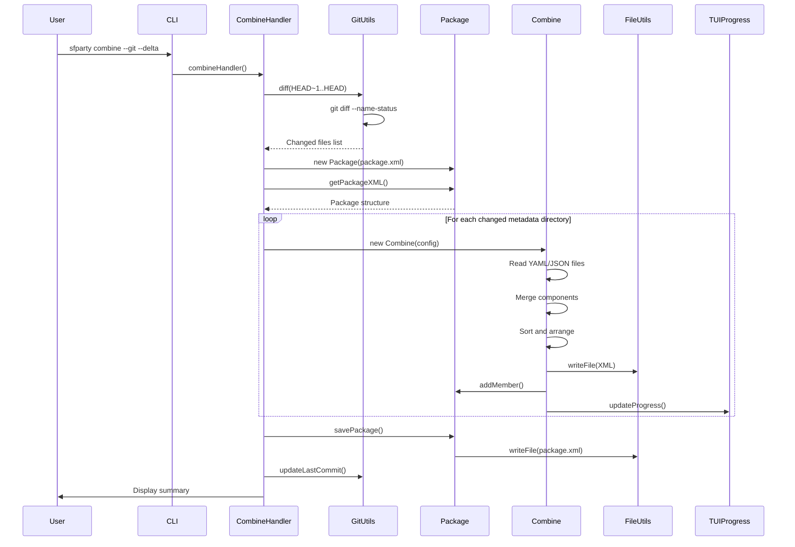

# Technical Deep-Dive: `@ds-sfdc/sfparty`

## 1. Executive Summary

-   **Codebase Name:** `@ds-sfdc/sfparty` (sfparty)
-   **Type:** CLI Tool
-   **Purpose & Domain:** sfparty is a command-line utility designed to improve the developer and DevOps experience when working with Salesforce metadata. It addresses the common problem of large, monolithic XML metadata files that are difficult to read, diff, merge, and maintain. The tool splits Salesforce metadata XML files into smaller, more manageable YAML or JSON parts, making version control easier and eliminating merge conflicts. It can also combine these parts back into XML files, making it ideal for CI/CD pipelines. The tool supports multiple metadata types including Profiles, Permission Sets, Workflows, and Custom Labels.
-   **Key Technologies:** 
    - TypeScript (ES2022)
    - Node.js (>=0.11)
    - Bun (package manager and runtime)
    - fast-xml-parser (XML parsing)
    - js-yaml (YAML serialization)
    - blessed & blessed-contrib (Terminal User Interface)
    - yargs (CLI argument parsing)
    - winston (logging)
    - vitest (testing framework)
    - Biome (linting and formatting)

---

## 2. Architectural Overview

-   **Architectural Style:** Layered Architecture with Command Pattern
    - The codebase follows a layered architecture with clear separation between CLI interface, business logic, and utility layers
    - Commands (split, combine) are implemented using the Command pattern
    - Metadata type definitions are separated into their own modules
    - Utility functions are organized by domain (file operations, git operations, package management)

-   **Component Diagram:**



-   **Project Structure:**

```
sfparty/
├── src/
│   ├── index.ts                    # Main CLI entry point
│   ├── lib/                        # Core utility libraries
│   │   ├── checkVersion.ts         # Version checking and updates
│   │   ├── fileUtils.ts            # File system operations
│   │   ├── gitUtils.ts             # Git integration
│   │   ├── packageUtil.ts          # Package.xml management
│   │   ├── performanceLogger.ts    # Performance metrics
│   │   ├── pkgObj.ts               # Package.json access
│   │   ├── tui.ts                  # Terminal User Interface
│   │   ├── tuiProgressTracker.ts   # Progress tracking wrapper
│   │   └── writeBatcher.ts         # Batched file writes
│   ├── meta/                       # Metadata type definitions
│   │   ├── CustomLabels.ts
│   │   ├── Package.ts
│   │   ├── PermissionSets.ts
│   │   ├── Profiles.ts
│   │   ├── Workflows.ts
│   │   └── yargs.ts                # CLI option definitions
│   ├── party/                      # Core business logic
│   │   ├── combine.ts              # Combine YAML/JSON → XML
│   │   └── split.ts                # Split XML → YAML/JSON
│   └── types/
│       └── metadata.ts             # TypeScript type definitions
├── test/                           # Test files
├── dist/                           # Compiled JavaScript output
└── examples/                       # Example metadata files
```

-   **Entry Points:**
    - **Primary:** `src/index.ts` - Main CLI entry point executed via `bin.sfparty` in package.json
    - **Commands:** 
        - `split` - Splits XML metadata files into YAML/JSON
        - `combine` - Combines YAML/JSON files back into XML
        - `update` - Checks for and updates to latest version
        - `help` - Displays README.md as formatted help

-   **Module/Component Analysis:**

| Module | Responsibility |
|--------|---------------|
| `index.ts` | CLI orchestration, command routing, global state management, resource-aware concurrency control |
| `party/split.ts` | XML parsing, JSON transformation, file splitting logic, metadata structure handling |
| `party/combine.ts` | YAML/JSON reading, XML generation, file combining logic, package.xml management |
| `lib/fileUtils.ts` | File system operations, path validation, YAML/JSON serialization, batched writes |
| `lib/gitUtils.ts` | Git diff operations, commit tracking, file change detection |
| `lib/packageUtil.ts` | Package.xml reading/writing, member management for CI/CD |
| `lib/tui.ts` | Terminal User Interface rendering, progress visualization |
| `lib/tuiProgressTracker.ts` | Progress tracking abstraction, TUI integration |
| `lib/writeBatcher.ts` | Batched file write operations for performance |
| `lib/performanceLogger.ts` | Performance metrics collection and reporting |
| `meta/*.ts` | Metadata type definitions (structure, sorting, key ordering) |

-   **API/Interface Analysis:**

### CLI Commands

#### `sfparty split`
Splits Salesforce metadata XML files into YAML or JSON parts.

**Options:**
- `-y, --type <types>` - Metadata type(s) to process (label, profile, permset, workflow)
- `-n, --name <name>` - Name of specific metadata file to process
- `-f, --format <format>` - Output format: `yaml` (default) or `json`
- `-s, --source <path>` - Source directory path (from sfdx-project.json)
- `-t, --target <path>` - Target directory for output files
- `--keepFalseValues` - Keep false permission values (default: false, removes empty permissions)

**Examples:**
```bash
sfparty split --type=profile --all
sfparty split --type=profile --name="My Profile"
sfparty split --type="workflow,label"
```

#### `sfparty combine`
Combines YAML/JSON files back into Salesforce metadata XML files.

**Options:**
- `-y, --type <types>` - Metadata type(s) to process
- `-n, --name <name>` - Name of specific metadata to combine
- `-f, --format <format>` - Input format: `yaml` (default) or `json`
- `-s, --source <path>` - Source directory (YAML/JSON files)
- `-t, --target <path>` - Target directory for XML output
- `-g, --git [ref]` - Process files based on git commits (optional ref like `HEAD~1..HEAD`)
- `-a, --append` - Append to existing package.xml instead of overwriting
- `-l, --delta` - Create delta metadata files for CI/CD deployment
- `-p, --package <path>` - Path to package.xml file
- `-x, --destructive <path>` - Path to destructiveChanges.xml file

**Examples:**
```bash
sfparty combine --type=profile --all
sfparty combine --git=HEAD~1..HEAD --append --delta --package=deploy/package.xml
```

#### `sfparty update`
Checks for and installs the latest version of sfparty.

#### `sfparty help`
Displays the README.md file as formatted terminal help.

---

## 3. Dependency Analysis

-   **Package Dependencies:**

| Package | Version | Purpose |
|---------|---------|----------|
| `fast-xml-parser` | ^5.3.3 | XML parsing and building (replaces xml2js) |
| `js-yaml` | ^4.1.1 | YAML serialization/deserialization |
| `yargs` | ^17.7.2 | CLI argument parsing and command handling |
| `blessed` | ^0.1.81 | Terminal UI framework |
| `blessed-contrib` | ^4.11.0 | Terminal UI widgets (grids, charts) |
| `winston` | ^3.17.0 | Structured logging |
| `axios` | ^1.13.2 | HTTP requests for version checking |
| `semver` | ^7.6.3 | Semantic version comparison |
| `cli-color` | ^2.0.4 | Terminal text coloring |
| `marked` | ^14.1.3 | Markdown parsing for help |
| `marked-terminal` | ^7.2.1 | Markdown to terminal rendering |
| `ci-info` | ^4.1.0 | CI environment detection |
| `log-update` | ^6.1.0 | Terminal log updating |
| `ora` | ^8.1.1 | Terminal spinners (fallback) |
| `cli-spinners` | ^2.9.2 | Spinner animations |
| `convert-hrtime` | ^5.0.0 | High-resolution time conversion |

-   **External Dependencies:**
    - **Git:** Used for delta operations and change detection (via `child_process.spawn`)
    - **File System:** Node.js `fs` module for all file operations
    - **NPM Registry:** For version checking and updates (via axios)
    - **Salesforce DX Project:** Reads `sfdx-project.json` to determine package directories

-   **Configuration:**
    - **`sfdx-project.json`:** Required Salesforce project configuration file that defines:
        - `packageDirectories`: Array of package directory paths
        - `default`: Boolean indicating default package directory
        - `sourceApiVersion`: Salesforce API version
    - **Environment Variables:**
        - `TERM`: Terminal type (checked for TUI support)
        - `INIT_CWD`: Used to detect npx execution
    - **Command-Line Arguments:** All configuration via yargs (see API section above)
    - **Logging:** Logs written to `.sfdx/sfparty/sfparty.log` and `.sfdx/sfparty/performance.log`

---

## 4. Core Functionality Analysis

### For CLI Tools:

#### Command: `split`

**Description:** Splits large Salesforce metadata XML files into smaller, manageable YAML or JSON files organized by metadata structure.

**Handler:** `splitHandler()` in `src/index.ts` → `processSplit()` → `Split` class in `src/party/split.ts`

**Authorization:** None (local file operations only)

**Request Model:**
- Command-line arguments via yargs
- File paths resolved from `sfdx-project.json` or command-line options
- Metadata type(s) specified via `--type` option

**Success Response:**
- Creates directory structure: `{target}/main/default/{metadataType}/{metadataName}/`
- Generates YAML/JSON files for each metadata component
- Returns exit code 0

**Error Responses:**
- Exit code 1 if files not found, XML parsing errors, or file system errors
- Errors logged to console and log file

**Step-by-Step Flow Trace:**

1. **Entry:** Command parsed by yargs, `splitHandler()` invoked
2. **Initialization:**
   - Validates metadata types
   - Resolves source and target directories from `sfdx-project.json` or CLI args
   - Initializes global state (logger, progress tracker, format)
3. **File Discovery:**
   - Scans source directory for `*.{type}-meta.xml` files
   - Filters by `--name` if specified, or processes all files if `--all`
4. **Resource Management:**
   - `ResourceManager` calculates optimal concurrency based on:
     - CPU cores (baseline: 3x CPU cores for I/O-bound operations)
     - Available memory (estimates 30MB per file)
     - Current memory pressure (adjusts concurrency dynamically)
   - Initializes `WriteBatcher` for optimized file writes
5. **Progress Tracking:**
   - Creates `TUIProgressTracker` instance
   - Displays TUI with progress, active files, resource stats
6. **Concurrent Processing:**
   - Creates task array for each XML file
   - Uses `limitConcurrency()` to process files with adaptive concurrency
   - Each task:
     a. Reads XML file (with size validation, max 100MB)
     b. Parses XML to JSON using `fast-xml-parser`
     c. Transforms JSON structure based on metadata definition
     d. Splits into component files (directories, singleFiles, main)
     e. Saves YAML/JSON files via `WriteBatcher`
     f. Updates progress tracker
7. **Write Batching:**
   - `WriteBatcher` batches file writes to reduce I/O overhead
   - Batch size and delay adjusted based on memory pressure
   - Flushes remaining writes before completion
8. **Completion:**
   - Waits for all writes to complete
   - Displays summary with success/error counts
   - Prints performance metrics
   - Returns success/failure status

**Sequence Diagram:**



#### Command: `combine`

**Description:** Combines YAML/JSON files back into Salesforce metadata XML files, optionally based on git changes for CI/CD.

**Handler:** `combineHandler()` in `src/index.ts` → `processCombine()` → `Combine` class in `src/party/combine.ts`

**Authorization:** None (local file operations only)

**Request Model:**
- Command-line arguments via yargs
- Optional git reference for delta operations
- Package.xml paths for CI/CD integration

**Success Response:**
- Creates XML files in target directory
- Optionally updates package.xml and destructiveChanges.xml
- Returns exit code 0

**Error Responses:**
- Exit code 1 if YAML parsing errors, missing files, or XML generation errors
- Errors logged to console and log file

**Step-by-Step Flow Trace:**

1. **Entry:** Command parsed by yargs, `combineHandler()` invoked
2. **Git Mode (if enabled):**
   - If `--git` specified, calls `gitUtils.diff()` to get changed files
   - Filters changes to only process modified metadata
   - Loads existing package.xml files if `--append` specified
3. **Initialization:**
   - Resolves source (YAML/JSON) and target (XML) directories
   - Initializes `Package` instances for package.xml management
4. **File Discovery:**
   - If git mode: processes only changed directories
   - Otherwise: scans source directory for metadata directories
5. **Resource Management:**
   - Same resource-aware concurrency as split operation
6. **Progress Tracking:**
   - Creates `TUIProgressTracker` for combine operation
7. **Concurrent Processing:**
   - Creates task array for each metadata directory
   - Each task:
     a. Reads YAML/JSON files from directory structure
     b. Processes main file, singleFiles, and directories
     c. Merges components into JSON structure
     d. Sorts and arranges keys according to metadata definition
     e. Generates XML using `fast-xml-parser` XMLBuilder
     f. Writes XML file
     g. Updates package.xml if git mode enabled
8. **Package Management:**
   - Adds members to package.xml for changed metadata
   - Adds to destructiveChanges.xml for deleted metadata
   - Saves package.xml files if git mode enabled
9. **Completion:**
   - Updates git last commit tracking if enabled
   - Displays summary
   - Returns success/failure status

**Sequence Diagram:**



### Metadata Type Support

The tool supports four metadata types, each with specific structure definitions:

1. **Profiles** (`profile`)
   - Complex structure with fieldPermissions, objectPermissions, classAccesses, etc.
   - Supports splitting by object for fieldPermissions and objectPermissions
   - Handles loginIpRanges with sandbox variants

2. **Permission Sets** (`permset`)
   - Similar structure to profiles but simpler
   - Supports same splitting strategies

3. **Workflows** (`workflow`)
   - Workflow rules, field updates, alerts, etc.
   - Supports delta operations

4. **Custom Labels** (`label`)
   - Single file structure (no name option)
   - All labels in one file

---

## 5. Data Model & State Management

-   **Data Structures:**

### MetadataDefinition Interface
Core interface defining how each metadata type is structured:

```typescript
interface MetadataDefinition {
  metaUrl: string                    // Documentation URL
  directory: string                  // Directory name (e.g., "profiles")
  filetype: string                   // File extension (e.g., "profile")
  root: string                       // XML root tag (e.g., "Profile")
  type: string                       // Metadata type (e.g., "Profile")
  alias: string                      // CLI alias (e.g., "profile")
  main: string[]                     // Keys to include in main file
  singleFiles?: string[]             // Keys that become single files
  directories?: string[]             // Keys that become directories
  splitObjects?: string[]            // Keys split by object name
  sortKeys: Record<string, string>   // Sort key for each array
  keyOrder?: Record<string, string[]> // Key ordering within objects
  xmlOrder?: Record<string, string[]> // XML element ordering
  xmlFirst?: string                  // First XML element
  packageTypeIsDirectory?: boolean   // Whether package type is directory-based
  delta?: boolean                    // Supports delta operations
  package?: Record<string, string>   // Package type mapping
}
```

### Global Context
Global state managed via `global` object:

```typescript
interface GlobalContext {
  __basedir?: string                 // Project root directory
  logger?: Logger                    // Winston logger instance
  consoleTransport?: { silent?: boolean } // Console transport control
  icons?: Icons                      // UI icons
  displayError?: (error: string, quit?: boolean) => void
  git?: GitConfig                    // Git operation configuration
  metaTypes?: Record<string, MetaTypeEntry> // Metadata type registry
  runType?: string | null            // Execution context (npx/node/global)
  format?: string                    // Output format (yaml/json)
  process?: ProcessedStats            // Processing statistics
}
```

-   **Relationships:**
    - Metadata types are registered in `global.metaTypes` with their definitions
    - Each metadata type has a definition that specifies its structure
    - Package.xml structure mirrors Salesforce metadata package format

-   **Data Persistence:**
    - **Source Files:** XML files in `force-app/main/default/{metadataType}/`
    - **Split Files:** YAML/JSON files in `force-app-party/main/default/{metadataType}/{name}/`
    - **Package Files:** `manifest/package.xml` and `manifest/destructiveChanges.xml`
    - **Logs:** `.sfdx/sfparty/sfparty.log` and `.sfdx/sfparty/performance.log`
    - **Git Tracking:** `.sfdx/sfparty/.git` (JSON file tracking last commit)

-   **State Management:**
    - Global state via `global` object (Node.js global scope)
    - Processing state tracked in `ProcessedStats` interface
    - Progress state managed by `TUIProgressTracker`
    - No persistent state between runs (stateless design)

---

## 6. Cross-Cutting Concerns

-   **Logging & Monitoring:**
    - **Framework:** Winston logger with multiple transports
    - **Console Transport:** Toggleable (silenced during TUI mode)
    - **File Transport:** Logs warnings and errors to `.sfdx/sfparty/sfparty.log`
    - **Performance Logging:** Separate logger tracks file read/parse/write times to `.sfdx/sfparty/performance.log`
    - **Log Levels:** error (0), warn (1), info (2), http (3), verbose (4), debug (5), silly (6)
    - **Observability:** TUI displays real-time progress, resource usage, and queue statistics

-   **Error Handling:**
    - **Global Error Handler:** `global.displayError()` function for consistent error display
    - **Try-Catch Patterns:** Extensive error handling in async operations
    - **Error Propagation:** Errors are caught, logged, and propagated appropriately
    - **Validation:** Input validation for file paths, git references, metadata types
    - **Security:** Path traversal protection, file size limits, safe JSON parsing

-   **Authentication & Authorization:**
    - **None Required:** All operations are local file system operations
    - **Git Operations:** Uses local git repository (no authentication needed)
    - **Security Measures:**
      - Path validation to prevent directory traversal
      - Git reference sanitization to prevent command injection
      - Safe JSON parsing to prevent prototype pollution
      - File size limits to prevent memory exhaustion

-   **Testing:**
    - **Framework:** Vitest (Vite-based test runner)
    - **Test Structure:** Unit tests in `test/` directory mirroring `src/` structure
    - **Coverage:** V8 coverage provider with HTML, text, clover, and JSON reporters
    - **Exclusions:** CLI entry point and TUI components excluded from coverage (require integration testing)
    - **Isolation:** Tests run with `isolate: true` and `maxWorkers: 1` for stability
    - **Setup:** `test/setup.ts` for test initialization

-   **Build & Deployment:**
    - **Build Tool:** TypeScript compiler (`tsc`)
    - **Output:** Compiled JavaScript to `dist/` directory
    - **Package Manager:** Bun (not npm)
    - **Scripts:**
      - `build`: Compile TypeScript
      - `build:watch`: Watch mode compilation
      - `test`: Run tests with build
      - `test:coverage`: Generate coverage reports
      - `lint`: Biome linting
      - `format`: Biome formatting
    - **CI/CD:** GitHub Actions workflow (referenced in README badge)
    - **Publishing:** NPM package published as `@ds-sfdc/sfparty`

-   **Performance Considerations:**
    - **Resource-Aware Concurrency:** Dynamically adjusts concurrency based on CPU and memory
    - **Write Batching:** Batches file writes to reduce I/O overhead
    - **XML Parser Reuse:** Reuses XMLParser instances to avoid recreation overhead
    - **Memory Management:** File size limits (100MB), memory pressure detection
    - **Parallel Processing:** Processes multiple files concurrently with adaptive limits
    - **Performance Logging:** Tracks and reports read/parse/write times per file
    - **Optimizations:**
      - In-place JSON transformation to avoid stringify/parse round-trips
      - Combined file existence and stat calls
      - Direct file reads (read queue removed for better performance)

---

## 7. Development & Contribution Guide

-   **Getting Started:**

1. **Prerequisites:**
   - Node.js >= 0.11 (though modern Node.js recommended)
   - Bun (package manager and runtime)
   - Git (for git operations)
   - A Salesforce project with `sfdx-project.json`

2. **Installation:**
   ```bash
   git clone <repository-url>
   cd sfparty
   bun install
   ```

3. **Environment Setup:**
   - No environment variables required for basic operation
   - `sfdx-project.json` must exist in project root or specify `--source` path
   - Logs will be created in `.sfdx/sfparty/` directory

4. **Running Locally:**
   ```bash
   bun run build
   bun run dist/index.js split --type=profile --all
   ```

-   **Development Workflow:**

1. **Development Mode:**
   ```bash
   bun run build:watch  # Watch mode for TypeScript compilation
   ```

2. **Testing:**
   ```bash
   bun test              # Run tests
   bun test:watch        # Watch mode
   bun test:coverage     # Generate coverage report
   bun test:ui           # Vitest UI
   ```

3. **Linting & Formatting:**
   ```bash
   bun run lint          # Check for linting errors
   bun run lint:fix      # Auto-fix linting errors
   bun run format        # Format code
   ```

4. **Debugging:**
   - Use Node.js debugger: `node --inspect dist/index.js split --type=profile`
   - TUI can be disabled by setting `TERM=dumb` environment variable
   - Logs available in `.sfdx/sfparty/sfparty.log`

-   **Testing:**
   - Tests use Vitest with Node.js environment
   - Test files located in `test/` directory mirroring `src/` structure
   - Run specific test: `bun test test/party/split.test.ts`
   - Coverage reports generated in `coverage/` directory

-   **Code Style & Standards:**
   - **Linter:** Biome (replaces ESLint)
   - **Formatter:** Biome (replaces Prettier)
   - **Style Rules:**
     - Indent: 4 spaces (tabs)
     - Line width: 80 characters
     - Quote style: Single quotes
     - Semicolons: As needed
     - Trailing commas: All
   - **TypeScript:** Strict mode enabled
   - **Git Hooks:** Husky with lint-staged for pre-commit linting

-   **Suggested Extension Points:**

1. **Adding New Metadata Types:**
   - Create new file in `src/meta/` (e.g., `CustomObjects.ts`)
   - Define `MetadataDefinition` with structure, sort keys, key ordering
   - Register in `global.metaTypes` in `src/index.ts`
   - Add to `typeArray` constant
   - Update `yargs.ts` examples if needed

2. **Enhancing TUI:**
   - Modify `src/lib/tui.ts` for UI changes
   - Update `src/lib/tuiProgressTracker.ts` for progress tracking changes
   - TUI uses blessed-contrib grid layout

3. **Performance Optimizations:**
   - Adjust `ResourceManager` calculations in `src/index.ts`
   - Modify `WriteBatcher` batch size/delay in `src/lib/writeBatcher.ts`
   - Tune concurrency limits (currently 10-100)

4. **Git Integration:**
   - Extend `src/lib/gitUtils.ts` for additional git operations
   - Add new git reference formats if needed

5. **Package Management:**
   - Extend `src/lib/packageUtil.ts` for additional package.xml features
   - Add support for other Salesforce package formats

-   **Identified Risks & Technical Debt:**

1. **Security:**
   - ✅ Path traversal protection implemented
   - ✅ Git reference sanitization implemented
   - ✅ Safe JSON parsing implemented
   - ✅ File size limits implemented
   - ⚠️ Consider adding rate limiting for file operations
   - ⚠️ Consider adding file type validation beyond extension checking

2. **Performance:**
   - ✅ Resource-aware concurrency implemented
   - ✅ Write batching implemented
   - ⚠️ Large metadata files (>100MB) are rejected but could be streamed
   - ⚠️ Memory usage could be optimized further for very large projects

3. **Code Quality:**
   - ⚠️ Some `@ts-expect-error` comments for yargs type mismatches
   - ⚠️ Global state usage could be refactored to dependency injection
   - ⚠️ TUI error suppression for terminal capabilities is aggressive

4. **Testing:**
   - ⚠️ TUI components excluded from coverage (difficult to test)
   - ⚠️ Integration tests for full workflows could be added
   - ⚠️ Git operations testing could be enhanced

5. **Documentation:**
   - ⚠️ JSDoc comments could be more comprehensive
   - ⚠️ Architecture decision documentation could be added

-   **Common Tasks:**

1. **Adding a New Metadata Type:**
   ```typescript
   // 1. Create src/meta/NewType.ts
   export const metadataDefinition: MetadataDefinition = { /* ... */ }
   
   // 2. Import in src/index.ts
   import * as newTypeDefinition from './meta/NewType.js'
   
   // 3. Register in global.metaTypes
   global.metaTypes = {
     // ... existing types
     newtype: {
       type: newTypeDefinition.metadataDefinition.filetype,
       definition: newTypeDefinition.metadataDefinition,
       add: { files: [], directories: [] },
       remove: { files: [], directories: [] },
     },
   }
   
   // 4. Add to typeArray
   const typeArray = ['label', 'profile', 'permset', 'workflow', 'newtype'] as const
   ```

2. **Modifying Split Logic:**
   - Edit `src/party/split.ts`
   - Key functions: `split()`, `processJSON()`, `processFile()`, `processDirectory()`
   - Test with: `bun test test/party/split.test.ts`

3. **Modifying Combine Logic:**
   - Edit `src/party/combine.ts`
   - Key functions: `combine()`, `processParts()`, `processFile()`, `saveXML()`
   - Test with: `bun test test/party/combine.test.ts`

4. **Updating Dependencies:**
   ```bash
   bun update <package-name>
   bun run build
   bun test
   ```

5. **Debugging Performance Issues:**
   - Check `.sfdx/sfparty/performance.log` for per-file metrics
   - Review resource stats in TUI during execution
   - Adjust `ResourceManager` calculations if needed

6. **Handling Git Operations:**
   - Git operations use `child_process.spawn` for security
   - Git references are validated and sanitized
   - Last commit tracking stored in `.sfdx/sfparty/.git` JSON file


